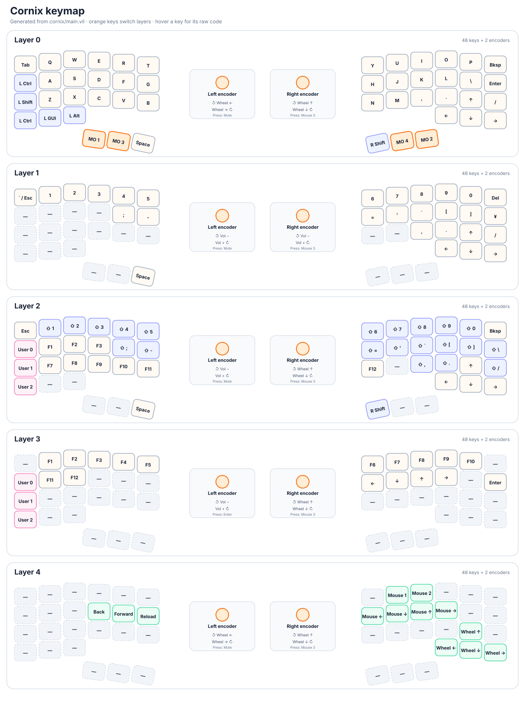

# My Cornix key mapping

source: https://github.com/ultsaza/vial/blob/master/cornix/main.vil



## for update

```bash
# these will be executed by gh actions
cargo test --locked
cargo run --locked -- cornix/main.vil docs/cornix-keymap.svg
```
